## LDTS_t02g04 - <Celeste Pico 8>

O projeto pretende recriar o jogo de plataforma Celeste na versão feita no Pico 8 (uma *engine* de jogos 8 bits).
O objetivo do jogo é controlar Madeline (personagem principal) a escalar a montanha Celeste enquanto coleta morangos. O personagem consegue andar, pular e dar *dashes* para ultrapassar obstáculos e chegar ao pico da montanha.

Este projeto foi desenvolvido pelo Gustavo Pereira da Cunha Bastos (up202403874@up.pt) e pelo *Tiago Su* (up202403468@up.pt) para a cadeira LDTS 2025/2026

### IMPLEMENTED FEATURES

- **Player Controller** - O *player* consegue controlar o personagem usando as setas do teclado para mover o personagem, usar o botão C para pular e o botão X e com as setas para dar um *dash* na direção pressionada, além disso, ao tocar uma parede é possível deslizar e executar um *wall jump* se pressionar o botão do pulo enquanto desliza;
- **Animações** - O jogo contém *sprites* animados;
- **Colisões** - O jogo contém colisões funcionais, de modo a impedir *overlaps* de objetos;
- **Arena loader** - Dado um ficheiro .csv com as notações corretas, é possível gerar um *level*;
- **Estados do jogo** - Existe um menu inicial, uma tela de finalização do jogo e é possível pausar o jogo, ao apertar o botão ESCAPE;
- **Níveis produzidos** - O jogo contém 5 níveis possíveis de vencer;
- **Efeitos sonoros** - O jogo tem uma música de *background* e efeitos sonoros para o pulo e o *dash*.

### *Gameplay* do jogo

  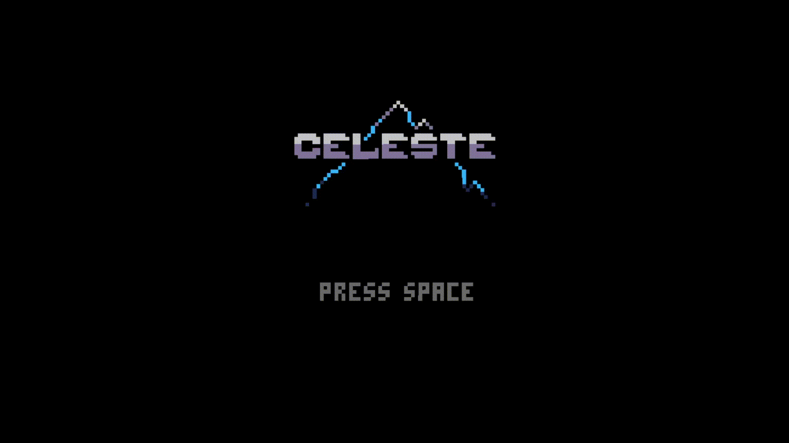

  <b><i>Fig. 1 Menu inicial e fase 1 e 2</i></b>

  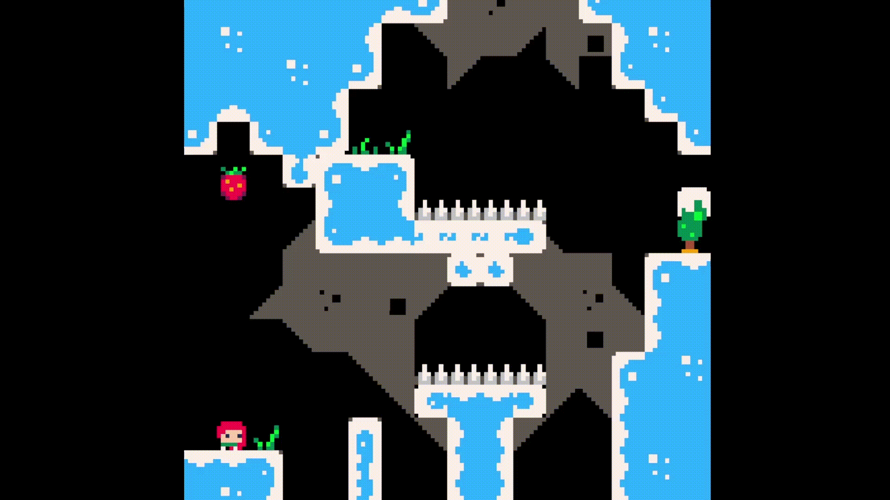

  <b><i>Fig. 2 Fase 3 e 4</i></b>

  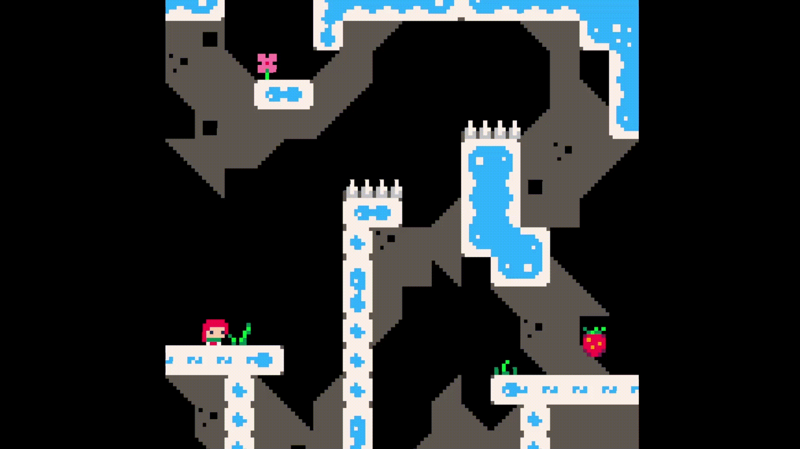

  <b><i>Fig. 3 Fase 5</i></b>

### DESIGN

#### Como criar objetos que tenham uma imagem e física de forma eficiente

**Problem in Context**

Um jogo é composto por muitos objetos com funcionalidades semelhantes, como desenhar uma imagem ou checar colisões e entre outros. Dessa forma, o problema em questão é como podemos implementar essas funcionalidades específicas, de forma eficiente e de modo a evitar repetir implementações desnecessárias.

**The Pattern**

Para resolver isso, decidimos usar como referência os componentes das *engines* como Unity e Godot, ou seja, utilizamos o *Composite Pattern*, de modo, a criar componentes básicos capazes de executar uma única funcionalidade, e devem ser independentes do objeto que os contém.
Assim, qualquer objeto é composto por esses componentes, facilitando a implementação de vários objetos com comportamentos parecidos e evitando repetir o mesmo código.
Este *design* tem como ideia de promover ao máximo o *Single Responsibility Principle*.

**Implementation**

Para implementar esta solução, criamos uma classe abstrata *Node* que contém, uma posição, um valor *offset* para a sua posição e um método *update* que atualiza a sua posição. A partir dessa classe serão criadas subclasses que serão os componentes.
Os componentes criados para o projeto foram:
- *SolidSprite*: um componente para desenhar um *sprite* usando o *TextImage* do *lanterna*, o que considera píxeis invisíveis como píxeis pretos;
- *TransparentSprite*: um componente para desenhar um *sprite* considerando apenas píxeis não transparentes;
- *AnimatedSprite*: um componente capaz de desenhar uma animação;
- *BoxCollider*: um componente que representa um *collider*, responsável por verificar colisões entre objetos;
- RigidBody: um componente responsável por calcular a próxima posição válida dada uma velocidade.

  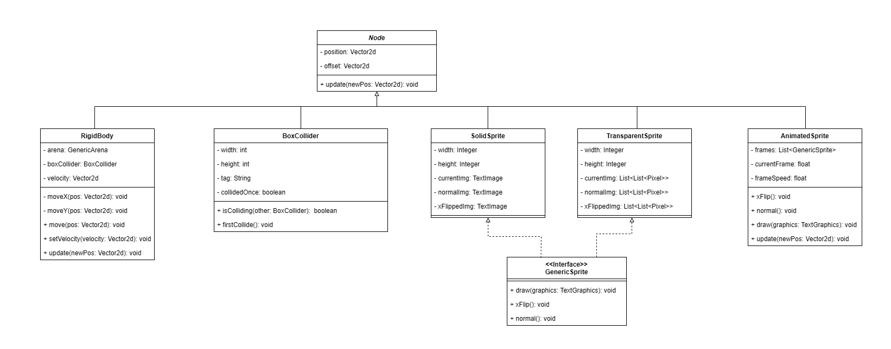

  <b><i>Fig. 6 UML dos componentes</i></b>

As classes relacionadas com o tópico podem ser achadas nos seguintes ficheiros:
- [Node](src/main/java/com/aor/components/Node.java)
- [SolidSprite](src/main/java/com/aor/components/sprites/SolidSprite.java)
- [TransparentSprite](src/main/java/com/aor/components/sprites/TransparentSprite.java)
- [AnimatedSprite](src/main/java/com/aor/components/sprites/AnimatedSprite.java)
- [BoxCollider](src/main/java/com/aor/components/BoxCollider.java)
- [RigidBody](src/main/java/com/aor/components/RigidBody.java)

**Consequences**

O uso dessa estratégia teve os seguintes benefícios:
- Uma vez implementado a funcionalidade não será necessária preocupar-se com a implementação de novo;
- Facilidade em criar objetos como, por exemplo, a classe HeroController composto por um *RigidBody* e vários *BoxColliders*;
- O *design* de blackbox ajuda em não se preocupar com detalhes particulares do funcionamento;
- Permite uma ótima flexibilidade na criação de objetos específicos;
- Boa organização respeitando o *Single Responsibility Principle*.

------

#### Como decidir quais *sprites* criar

**Problem in Context**

Por razões de otimização, o *lanterna* tem *TextImages* para desenhar imagens no terminal, em contraposição ao desenho feito caracter a caracter (píxel a píxel), mas essa alternativa tem um grande problema em tentar desenhar imagens que contêm píxeis invisiveis, ou seja, só é possível representar imagens retangulares totalmente preenchidas. No entanto, a maioria dos *sprites* usados no jogo não respeitam essa condição.
Por essa razão, como citado anteriormente, criamos duas versões de componentes capazes de desenhar. A questão é como utilizar, de forma eficiente, as duas versões.

**The Pattern**

Para resolver este dilema, optamos pelo uso do *design pattern factory method*.
Assim, podemos criar *factories* capazes de criar o tipo desejado de *sprite* sem precisar modificar ou criar classes.

**Implementation**

Para implementar esta solução, criamos uma interface chamada *GenericSpriteFactory* com os métodos para criar *sprites*.
Dessa forma, esta interface é implementada por classes chamadas *SolidSpriteFactory* e *TransparentSpriteFactory*, de modo, a criar *SolidSprites* e *TransparentSprites*, respetivamente. Assim, quando precisarmos de criar um objeto que não se sabe quais dos *sprites* usar no momento, podemos usar o *Factory*.

Neste projeto, o uso da *factory* só ficou relacionado com a classe *AnimatedSprite* que só é utilizada pelo *HeroView*, uma vez que todos os *sprites* do jogo têm transparência em alguns píxeis, o que trouxe uma complexidade desnecessária no projeto e por isso, optamos por não utilizar no resto do projeto.

Com base nisso, a estrutura dos *sprites* ficou a seguinte:

  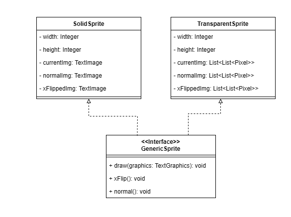

  <b><i>Fig. 7 UML dos sprites</i></b>

E a organização em *factory method* ficou assim:

  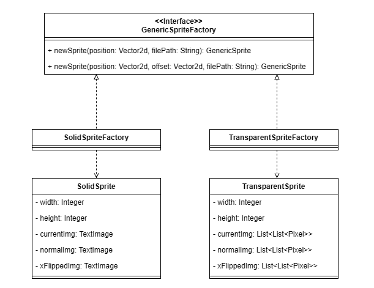

  <b><i>Fig. 8 UML do factory method</i></b>

As classes relacionadas com o tópico podem ser achadas nos seguintes ficheiros:

- [GenericSprite](src/main/java/com/aor/components/sprites/GenericSprite.java)
- [SolidSprite](src/main/java/com/aor/components/sprites/SolidSprite.java)
- [TransparentSprite](src/main/java/com/aor/components/sprites/TransparentSprite.java)
- [GenericSpriteFactory](src/main/java/com/aor/components/factory/GenericSpriteFactory.java)
- [SolidSpriteFactory](src/main/java/com/aor/components/factory/SolidSpriteFactory.java)
- [TransparentSpriteFactory](src/main/java/com/aor/components/factory/TransparentSpriteFactory.java)
- [AnimatedSprite](src/main/java/com/aor/components/sprites/AnimatedSprite.java)

**Consequences**

O uso desta estratégia teve os seguintes benefícios:
- Qualquer objeto que pode ter as duas variantes do *sprite* torna-se mais simples implementar, uma vez que não é necessário criar duas classes para o mesmo objeto;
- Permite uma melhor adaptabilidade no código.

------

#### Como estruturar o projeto

**Problem in Context**

Um grande problema no projeto, é como organizamos de forma estruturada as nossas classes, de forma, a evitar incongruências nos dados e melhorar a capacidade de manutenção do código.

**The Pattern**

Para organizar, o código decidimos estruturar o projeto seguindo os princípios do modelo MVC.
Esse modelo possibilita ter centralização de dados do objeto, ao ter uma classe única para armazenar dados, e na separação da parte visual e lógica ao ter um view e um controller, respetivamente.

**Implementation**

Para implementar cada classe do MVC, decidimos criar as seguintes interfaces:
- GenericModel
- GenericView
- GenericController

E para cada objeto do jogo com necessidade de ter comportamentos mais complexos, cria-se um MVC para cada um.
Assim, criamos MVCs para duas grandes entidades:
- *Hero*
- *Tile*

  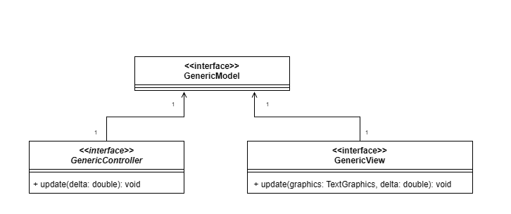

  <b><i>Fig. 9 UML do MVC genérico</i></b>

E com essa estrutura, a criação do *Hero* ficou assim (este MVC é bem extenso, então só vou apresentar os atributos e métodos mais importantes):

  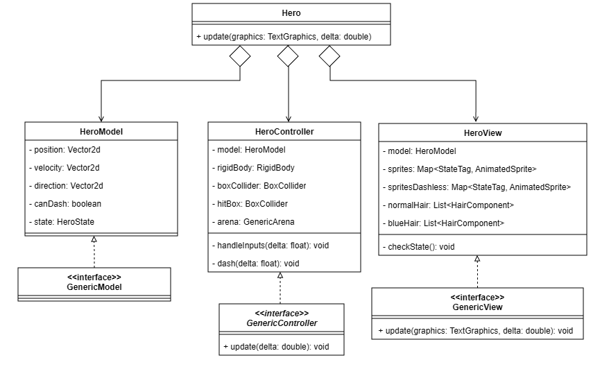

  <b><i>Fig. 10 MVC aplicado no Hero</i></b>

E com essa estrutura, a criação do *Tile* ficou assim:

  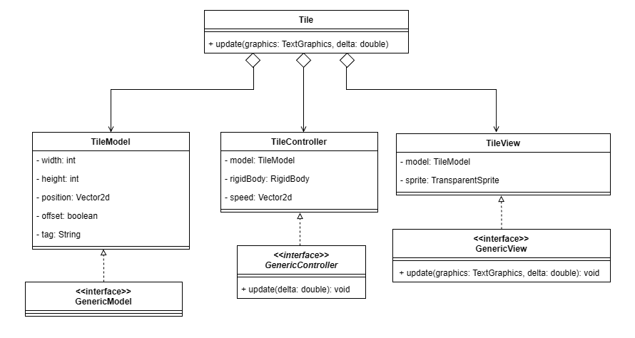

  <b><i>Fig. 11 MVC aplicado no Tile</i></b>

As classes relacionadas com o tópico podem ser achadas nos seguintes ficheiros:

- [GenericModel](src/main/java/com/aor/mvc/GenericModel.java)
- [GenericView](src/main/java/com/aor/mvc/GenericView.java)
- [GenericController](src/main/java/com/aor/mvc/GenericController.java)
- [Hero](src/main/java/com/aor/hero/mvc/Hero.java)
- [HeroModel](src/main/java/com/aor/hero/mvc/HeroModel.java)
- [HeroView](src/main/java/com/aor/hero/mvc/HeroView.java)
- [HeroController](src/main/java/com/aor/hero/mvc/HeroController.java)
- [Tile](src/main/java/com/aor/tile/Tile.java)
- [TileModel](src/main/java/com/aor/tile/TileModel.java)
- [TileView](src/main/java/com/aor/tile/TileView.java)
- [TileController](src/main/java/com/aor/tile/TileController.java)

**Consequences**

O uso dessa estratégia teve os seguintes benefícios:
- Boa organização de um objeto complexo;
- Maior facilidade em controlar as variáveis do objeto;
- Utilização do *Single Responsibility Principle*.

------

#### Como os objetos captam e leem *inputs*

**Problem in Context**

Durante o jogo, muitos objetos precisam captar e ler diversos *inputs*. E o problema é como captamos, guardamos e enviamos essa informação para o projeto todo:

**The Pattern**

Este problema foi resolvido usando dois *design patterns* que são *Singleton* e *Observers*. O uso de *Singleton* vai permitir centralizar os dados dos *inputs* numa só instância e evitar a passagem por argumentos de valores entre objetos.
E para ler os *inputs*, decidimos utilizar observers que vão enviar um sinal quando existe um *input* feito pelo *player*.

**Implementation**

No projeto, para representar o estado dos *inputs*, criamos um enumerator chamado KeyState, que contém o estado:
- UP: qualquer botão que não foi pressionado;
- DOWN: qualquer botão que está a ser pressionado, mas ainda não foi lido;
- CONSUMED: qualquer botão que está a ser pressionado, mas já foi lido;

Esta distinção de estados servirá para casos de necessidade de distinguir se um botão está a ser pressionado ou foi pressionado naquele instante.

Para armazenar os estados dos botões, criamos uma classe chamada *InputHandler* em que tem armazenado um *hashmap* com os pares <*Integer*, *KeyState*>, em que o *Integer* é o identificador do botão pressionado.
A leitura de *inputs* foi implementada ao utilizar os *eventsListeners* do Java (*KeyListener*), em que fizemos *override* nas funções *keyPressed* e *keyReleased* em que ambas enviam um sinal para o Singleton atualizar o *hashmap*.
Por fim, para qualquer objeto que necessite de saber se um certo *input* foi pressionado, podemos usar *getKeyDown* ou *getKeyPressed* para ler uma única vez se o botão é pressionado ou para ler quando o botão está a ser pressionado.

  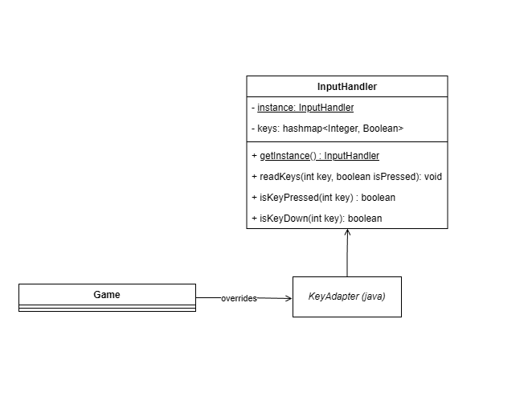

  <b><i>Fig. 12 UML do Inputhandler</i></b>

As classes relacionadas com o tópico podem ser achadas nos seguintes ficheiros:

- [InputHandler](src/main/java/com/aor/game/InputHandler.java)

**Consequences**

O uso dessa estratégia teve os seguintes benefícios:
- Facilidade em ler inputs, armazená-los e utilizá-los;
- Não é preciso ser preocupar em enviar os *inputs* de objeto para objeto;
- Informação centralizada.

Com o uso de *Singleton*, existe um grande problema no contexto de testar código.

------

#### Como representar o estado do jogo

**Problem in Context**

Enquanto o jogo executa, o mesmo pode estar no menu inicial, numa fase do jogo, pausado ou com a tela final. Dessa forma, como podemos programar esses estados, de forma eficaz:

**The Pattern**

Para facilitar a implementação de diversos possíveis estados do jogo, decidimos criar um *finite state machine*. Esta implementação, vai permitir facilidades em executar transições e executar os *updates* necessários no *game loop*.

**Implementation**

Para implementar esse *design pattern*, criamos uma interface *GameState* com um método *update*, responsável por executar a parte de necessária do *game loop* do respetivo estado e um método *transition* que analisa se é possível fazer uma transição e se for possível mudar de estado.

Com base nessa base, implementamos os seguintes estados:
- MenuState: que representa o menu inicial;
- RunningState: que representa o jogo durante os níveis do jogo;
- PausedState: um estado em que o jogo deve ficar pausado;
- EndState: um estado que representa o fim do jogo.

**Nota: transition() no diagrama de estados representa o método que é chamado para mudar de estado.**

  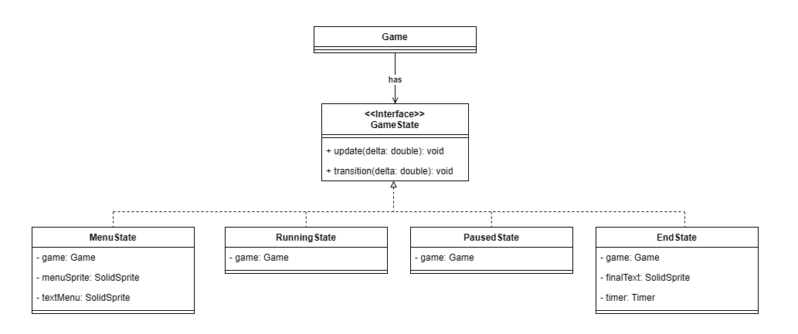

  <b><i>Fig. 13 UML do GameState</i></b>

  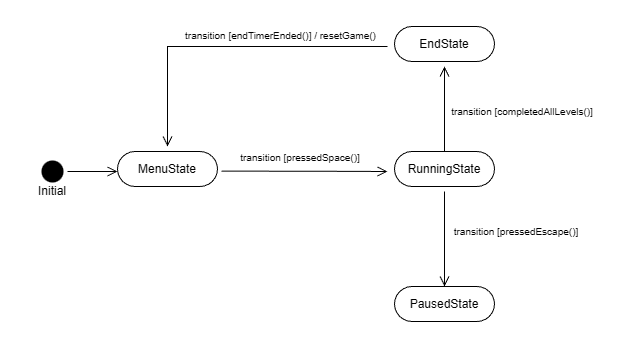

  <b><i>Fig. 14 State diagram do GameState</i></b>

As classes relacionadas com o tópico podem ser achadas nos seguintes ficheiros:

- [Game](src/main/java/com/aor/game/Game.java)
- [GameState](src/main/java/com/aor/game/state/GameState.java)
- [MenuState](src/main/java/com/aor/game/state/MenuState.java)
- [RunningState](src/main/java/com/aor/game/state/RunningState.java)
- [PausedState](src/main/java/com/aor/game/state/PausedState.java)
- [EndState](src/main/java/com/aor/game/state/EndState.java)

**Consequences**

O uso dessa estratégia teve os seguintes benefícios:
- Facilidade em decidir quais partes do projeto devem ser executadas no *game loop*;
- Uso de um *Design pattern* que respeita o *Open-closed principle*, de modo que para adicionar um novo estado só é necessário implementar a interface;
- Facilidade em visualizar e dividir os estados do jogo.

------

#### Como decidir quais *sprites* usar no *Hero* e qual física devo aplicar em cada momento

**Problem in Context**

No jogo, a parte visual e física do *Hero* dependem de várias condições como, por exemplo, se o *player* está no ar ou no chão para decidir qual atrito usar ou se o *hero* está a cair ou no chão para decidir quais *sprites* usar. Assim, com o aumento da complexidade da lógica do *player*, essas condições podem tornar-se bem problemáticas.

**The Pattern**

Para resolver esse problema, utilizamos, novamente, uma máquina de estados em que cada estado representa um conjunto de condições, com cada estado com capacidade de mudar para outro estado.

**Implementation**

Similarmente com a máquina de estados do *Game*, criamos uma interface chamada *HeroState* com um método *getVelocity* para executar a parte física do *player*, outro método *transition* para analisar e mudar de estado se for possível e outro método *update* para encapsular os dois métodos anteriores e uma função getTag para saber qual estado o *player* está.
Além disso, para estados que precisam de executar algo após entrar no estado, foi implementado outra interface chamada *EnterableState* com o método onEnter.

Com base nisso, criamos os seguintes estados:
- GroundedState: estado para o *Hero* a mover-se no chão;
- IdleState: estado para o *Hero* parado no chão;
- JumpingState: estado quando o *Hero* pula;
- FallingState: estado quando o *Hero* está em queda livre;
- SlidingState: estado quando o *Hero* desliza numa parede;
- WallJumpState: estado quando o *Hero* faz um *wall jump*.

Por fim, o estado atual é guardado no *HeroModel* para ser utilizado pelo *HeroController* e pelo *HeroView*.

**Nota: transition() no diagrama de estados representa o método chamado para mudar de estado. Além disso, qualquer estado pode mudar para o estado *DashingState*, por isso, decidimos representar todos os estados exceto o *DashingState* como *SuperState* para representar a transição para o *dash*.**

  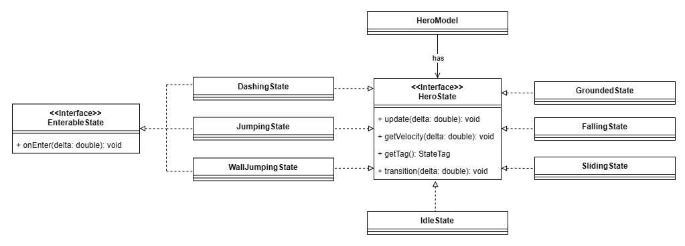

  <b><i>Fig. 15 UML do HeroState</i></b>

  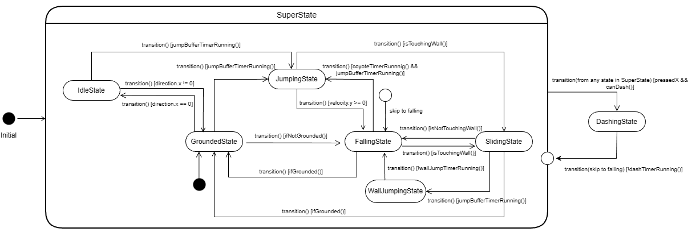

  <b><i>Fig. 16 Diagrama de estados do HeroState</i></b>

As classes relacionadas com o tópico podem ser achadas nos seguintes ficheiros:
- [StateTag](src/main/java/com/aor/hero/StateTag.java)
- [HeroModel](src/main/java/com/aor/hero/mvc/HeroModel.java)
- [HeroController](src/main/java/com/aor/hero/mvc/HeroController.java)
- [HeroView](src/main/java/com/aor/hero/mvc/HeroView.java)
- [HeroState](src/main/java/com/aor/hero/states/HeroState.java)
- [EnterableState](src/main/java/com/aor/hero/states/EnterableState.java)
- [GroundedState](src/main/java/com/aor/hero/states/GroundedState.java)
- [IdleState](src/main/java/com/aor/hero/states/IdleState.java)
- [JumpingState](src/main/java/com/aor/hero/states/JumpingState.java)
- [WallJumpState](src/main/java/com/aor/hero/states/WallJumpState.java)
- [SlidingState](src/main/java/com/aor/hero/states/SlidingState.java)
- [DashingState](src/main/java/com/aor/hero/states/DashingState.java)
- [FallingState](src/main/java/com/aor/hero/states/FallingState.java)

**Consequences**

O uso dessa estratégia teve os seguintes benefícios:
- Facilidade em decidir como deve a física comportar-se no momento;
- Facilidade em escolher quais dos *sprites* usar;
- Facilidade em adicionar um novo estado do *player* ao respeitar o *open-closed principle*.

------

#### KNOWN CODE SMELLS

1º Devido a restrições de tempo, a lógica do cabelo do personagem presente no *HeroView* tornou-se demasiado complicada de compreender devido à abundância de argumentos para a classe *HairComponent*.

2º Como dito anteriormente, a criação de duas versões de componentes para desenhar *sprites* com o *factory method* criado tornou-se, totalmente, desnecessária porque todos *assets* do jogo tinham píxeis transparentes, o que só aumentou a complexidade do projeto.

3º Criar uma Arena requer um *Hero*, contudo, a classe *Hero* necessita de uma Arena, dessa forma, existe um momento nas transições de cada fase do jogo em que o *Hero* é *null* e Arena fica a espera pela criação do *Hero*, o que pode levar a possibilidade de *NullPointerExceptions*.

4º Ao longo do projeto, usamos *paths* dos ficheiros da pasta *resources* para processar esses ficheiros por essa razão, para obter o .jar funcional tivemos que antes de utilizar o ficheiro criar um ficheiro temporário para utilizar os *paths*. Essa solução não é eficiente, contundo a outra solução necessitaria de refatorar o projeto por completo. 

### TESTING

Infelizmente, a classe *Game* e *Application* não são possíveis de testar porque são o ponto de partida do jogo.

  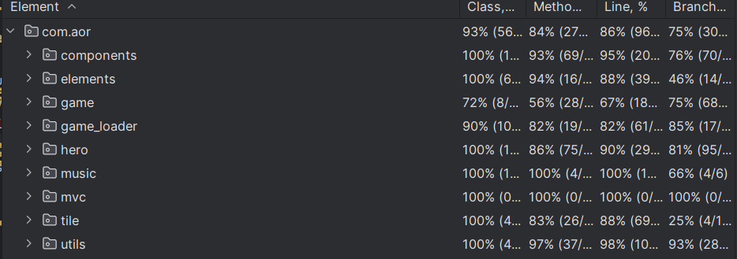

  <b><i>Fig. 17 Test Coverage</i></b>

*Link* para o relatório do *pitest*:
[Mutation Test](misc/pitest/index.html)

### SELF-EVALUATION

- Gustavo Pereira da Cunha Bastos: 50%
- Tiago Su: 50%